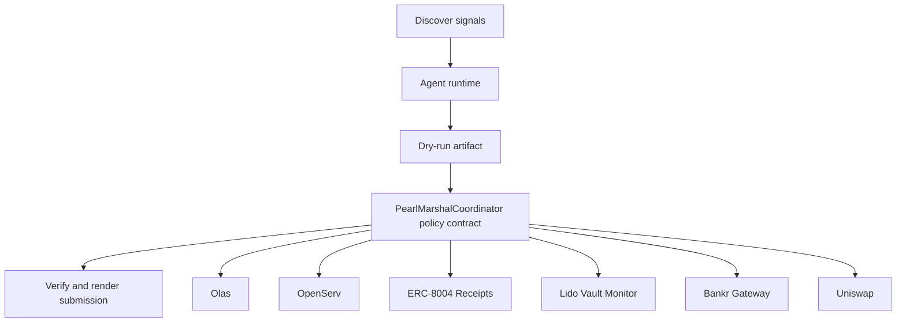

# Pearl Marshal

- **Repo:** [Synthesis-Olas](https://github.com/CrystallineButterfly/Synthesis-Olas)
- **Primary track:** Autonolas Olas
- **Category:** orchestration
- **Primary contract:** `PearlMarshalCoordinator`
- **Primary module:** `pearl_marshal`
- **Submission status:** audited and offline-demo ready; optional live partner credentials unlock network execution.

## What this repo does

A marketplace-ready swarm coordinator that hires specialized workers, serves its own monitoring API, and records request counts toward monetization targets.

## Why this build matters

The repo frames a marketplace agent that hires specialized workers, serves its own monitoring API, and records request counts toward monetization targets. Onchain coordination data is separated from Python service adapters so live mech-client or mech-server wiring can be dropped in later.

## Submission fit

- **Primary track:** Autonolas Olas
- **Overlap targets:** OpenServ, ERC-8004 Receipts, Lido Vault Monitor, Bankr Gateway, Uniswap Agentic Finance, Ampersend
- **Partners covered:** Olas, OpenServ, ERC-8004 Receipts, Lido Vault Monitor, Bankr Gateway, Uniswap, Ampersend

## Idea shortlist

1. Pearl-integrated Yield Ops Agent
2. Hire-and-Verify Execution Mesh
3. Monetized Lido Monitor

## System graph



## Repository contents

| Path | What it contains |
| --- | --- |
| `src/` | Shared policy contracts plus the repo-specific wrapper contract. |
| `script/Deploy.s.sol` | Foundry deployment entrypoint for the policy contract. |
| `agents/` | Python runtime, project spec, env handling, and partner adapters. |
| `scripts/` | Terminal entrypoints for run, demo planning, and submission rendering. |
| `docs/` | Architecture, credentials, security notes, and demo steps. |
| `submissions/` | Generated `synthesis.md` snippet for this repo. |
| `test/` | Foundry tests for the Solidity control layer. |
| `tests/` | Python tests for runtime and project context. |
| `agent.json` | Submission-facing agent manifest. |
| `agent_log.json` | Local execution log and status trail. |

## Autonomy loop

1. Discover signals relevant to the repo track and its overlap targets.
2. Build a bounded plan with per-action and compute caps.
3. Persist a dry-run artifact before any live execution.
4. Enforce onchain policy through the guarded contract wrapper.
5. Verify outputs, update receipts, and render submission material.

## Current readiness

- **Latest verification:** `verified` at `2026-03-19T03:52:16+00:00`
- **Execution mode:** `offline_prepared`
- **Offline-prepared partners:** ERC-8004 Receipts (prepared_contract_call), Lido Vault Monitor (prepared_contract_call)
- **Live credential blockers:** Olas, OpenServ, Bankr Gateway, Uniswap, Ampersend
- **Audit docs:** `docs/audit.md`, `docs/live_readiness.md`

## Most sensitive actions

- `bankr_gateway_compute_route` (Bankr Gateway, high)

## Live blocker details

- **Olas** — OLAS_API_KEY, OLAS_REQUEST_URL — https://docs.olas.network/
- **OpenServ** — OPENSERV_API_KEY, OPENSERV_AGENT_URL — https://docs.openserv.ai/
- **Bankr Gateway** — BANKR_API_KEY, BANKR_CHAT_COMPLETIONS_URL, BANKR_MODEL — https://bankr.bot/
- **Uniswap** — UNISWAP_API_KEY, UNISWAP_QUOTE_URL — https://developers.uniswap.org/
- **Ampersend** — AMPERSEND_API_KEY, AMPERSEND_PAYMENT_URL — https://docs.ampersend.ai/

## Latest evidence artifacts

- `artifacts/onchain_intents/erc_8004_receipts_receipt_anchor.json`
- `artifacts/onchain_intents/lido_vault_monitor_vault_alert.json`

## Security controls

- Admin-managed allowlists for targets and selectors.
- Per-action caps, daily caps, cooldown windows, and a principal floor.
- Reporter-only receipt anchoring and proof attachment.
- Env-only secrets; no committed private keys or partner tokens.
- Pause switch plus dry-run-first execution flow.

## Action catalog

| Action | Partner | Purpose | Max USD | Sensitivity |
| --- | --- | --- | --- | --- |
| `olas_market_hire` | Olas | Use Olas for a bounded action in this repo. | $20 | medium |
| `openserv_job_dispatch` | OpenServ | Use OpenServ for a bounded action in this repo. | $10 | medium |
| `erc_8004_receipts_receipt_anchor` | ERC-8004 Receipts | Use ERC-8004 Receipts for a bounded action in this repo. | $1 | medium |
| `lido_vault_monitor_vault_alert` | Lido Vault Monitor | Use Lido Vault Monitor for a bounded action in this repo. | $1 | medium |
| `bankr_gateway_compute_route` | Bankr Gateway | Use Bankr Gateway for a bounded action in this repo. | $10 | high |
| `uniswap_quote_route` | Uniswap | Use Uniswap for a bounded action in this repo. | $220 | medium |
| `ampersend_settlement_bundle` | Ampersend | Use Ampersend for a bounded action in this repo. | $25 | medium |

## Local terminal flow (Anvil + Sepolia)

```bash
export SEPOLIA_RPC_URL=https://sepolia.infura.io/v3/YOUR_KEY
anvil --fork-url "$SEPOLIA_RPC_URL" --chain-id 11155111
cp .env.example .env
# keep private keys only in .env; TODO.md stays local-only too
forge script script/Deploy.s.sol --rpc-url "$RPC_URL" --broadcast
python3 scripts/run_agent.py
python3 scripts/render_submission.py
```

## Commands

```bash
python3 -m unittest discover -s tests
forge test
python3 scripts/run_agent.py
python3 scripts/plan_live_demo.py
python3 scripts/render_submission.py
```

## Credentials

| Partner | Variables | Docs |
| --- | --- | --- |
| Olas | OLAS_API_KEY, OLAS_REQUEST_URL | https://docs.olas.network/ |
| OpenServ | OPENSERV_API_KEY, OPENSERV_AGENT_URL | https://docs.openserv.ai/ |
| ERC-8004 Receipts | RPC_URL | https://eips.ethereum.org/EIPS/eip-8004 |
| Lido Vault Monitor | RPC_URL | https://docs.lido.fi/ |
| Bankr Gateway | BANKR_API_KEY, BANKR_CHAT_COMPLETIONS_URL, BANKR_MODEL | https://bankr.bot/ |
| Uniswap | UNISWAP_API_KEY, UNISWAP_QUOTE_URL | https://developers.uniswap.org/ |
| Ampersend | AMPERSEND_API_KEY, AMPERSEND_PAYMENT_URL | https://docs.ampersend.ai/ |

## Live demo plan

1. Copy .env.example to .env and fill the required keys.
2. Deploy the contract with forge script script/Deploy.s.sol --broadcast for PearlMarshalCoordinator.
3. Run python3 scripts/run_agent.py to produce a dry run for pearl_marshal.
4. Set LIVE_MODE=true and rerun python3 scripts/run_agent.py with real credentials.
5. Run python3 scripts/render_submission.py and attach TxIDs plus repo links.
