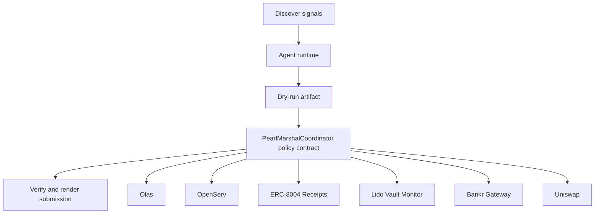

# Pearl Marshal

- **Repo:** `Synthesis-Olas`
- **Primary track:** Autonolas Olas
- **Category:** orchestration
- **Submission status:** implementation ready, waiting for credentials and TxIDs.

A marketplace-ready swarm coordinator that hires specialized workers, serves its own monitoring API, and records request counts toward monetization targets.

## Selected concept

The repo frames a marketplace agent that hires specialized workers, serves its own monitoring API, and records request counts toward monetization targets. Onchain coordination data is separated from Python service adapters so live mech-client or mech-server wiring can be dropped in later.

## Idea shortlist

1. Pearl-integrated Yield Ops Agent
2. Hire-and-Verify Execution Mesh
3. Monetized Lido Monitor

## Partners covered

Olas, OpenServ, ERC-8004 Receipts, Lido Vault Monitor, Bankr Gateway, Uniswap, Ampersend

## Architecture



## Repository layout

- `src/`: shared policy contracts plus the repo-specific wrapper contract.
- `script/`: Foundry deployment entrypoint.
- `agents/`: Python runtime, partner adapters, and project metadata.
- `scripts/`: CLI utilities for running the loop and rendering submissions.
- `docs/`: architecture, credentials, demo script, and security notes.
- `submissions/`: generated `synthesis.md` snippet for this repo.

## Action catalog

| Action | Partner | Purpose | Max USD | Sensitivity |
| --- | --- | --- | --- | --- |
| `olas_market_hire` | Olas | Use Olas for a bounded action in this repo. | $20 | medium |
| `openserv_job_dispatch` | OpenServ | Use OpenServ for a bounded action in this repo. | $10 | medium |
| `erc_8004_receipts_receipt_anchor` | ERC-8004 Receipts | Use ERC-8004 Receipts for a bounded action in this repo. | $1 | medium |
| `lido_vault_monitor_vault_alert` | Lido Vault Monitor | Use Lido Vault Monitor for a bounded action in this repo. | $1 | medium |
| `bankr_gateway_compute_route` | Bankr Gateway | Use Bankr Gateway for a bounded action in this repo. | $10 | high |
| `uniswap_quote_route` | Uniswap | Use Uniswap for a bounded action in this repo. | $220 | medium |
| `ampersend_settlement_bundle` | Ampersend | Use Ampersend for a bounded action in this repo. | $25 | medium |

## Commands

```bash
python3 -m unittest discover -s tests
forge test
python3 scripts/run_agent.py
python3 scripts/plan_live_demo.py
python3 scripts/render_submission.py
```

## Credentials

| Partner | Variables | Docs |
| --- | --- | --- |
| Olas | OLAS_API_KEY, OLAS_REQUEST_URL | https://docs.olas.network/ |
| OpenServ | OPENSERV_API_KEY, OPENSERV_AGENT_URL | https://docs.openserv.ai/ |
| ERC-8004 Receipts | RPC_URL | https://eips.ethereum.org/EIPS/eip-8004 |
| Lido Vault Monitor | RPC_URL | https://docs.lido.fi/ |
| Bankr Gateway | BANKR_API_KEY, BANKR_CHAT_COMPLETIONS_URL, BANKR_MODEL | https://bankr.bot/ |
| Uniswap | UNISWAP_API_KEY, UNISWAP_QUOTE_URL | https://developers.uniswap.org/ |
| Ampersend | AMPERSEND_API_KEY, AMPERSEND_PAYMENT_URL | https://docs.ampersend.ai/ |

## Live demo plan

1. Copy .env.example to .env and fill the required keys.
2. Deploy the contract with forge script script/Deploy.s.sol --broadcast for PearlMarshalCoordinator.
3. Run python3 scripts/run_agent.py to produce a dry run for pearl_marshal.
4. Set LIVE_MODE=true and rerun python3 scripts/run_agent.py with real credentials.
5. Run python3 scripts/render_submission.py and attach TxIDs plus repo links.
